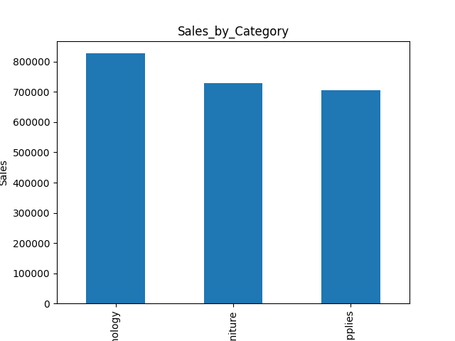
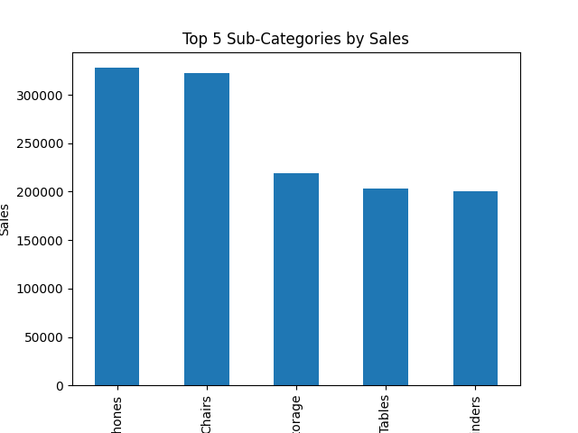
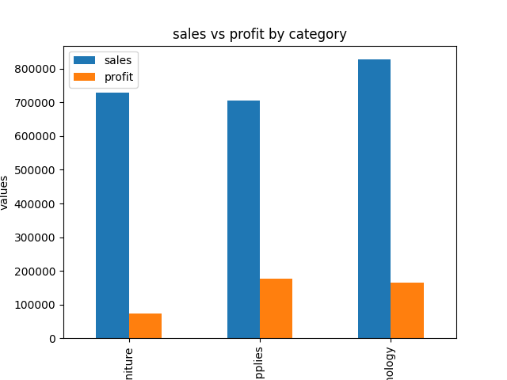

# 📊 Sales Data Analysis Project
## 📌 Overview
This project analyzes sales data using Python, Pandas, and Matplotlib.  
It performs data processing, visualization, and business insight extraction.
The goal is to understand:
- Sales performance by category
- Top-performing sub-categories
- Profit estimation
- Comparison of sales vs profit
## 📂 Dataset
- train.csv (sales dataset)
## 🛠 Tools Used
- Python
- Pandas
- Matplotlib
## 📊 Visualizations
### 1. Sales by Category

### 2. Top 5 Sub-Categories by Sales

### 3. Sales vs Profit by Category

## 📈 Key Insights
- Identified top-performing product categories
- Found most profitable segments
- Compared sales and estimated profit trends
## 🚀 How to Run
1. Clone this repository:
   git clone <your-repo-link>
2. Install required libraries:
   pip install pandas matplotlib
3. Run the program:
   python sales_analysis.py
